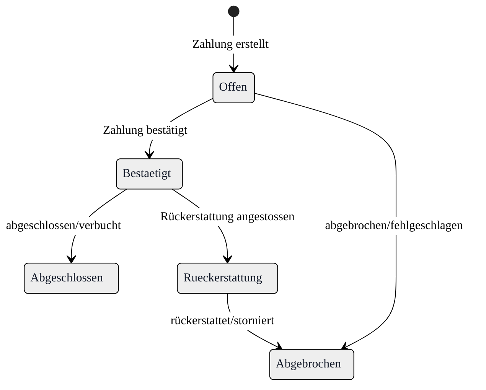
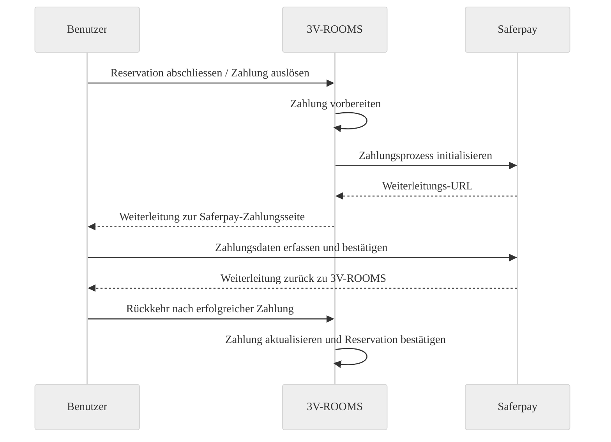
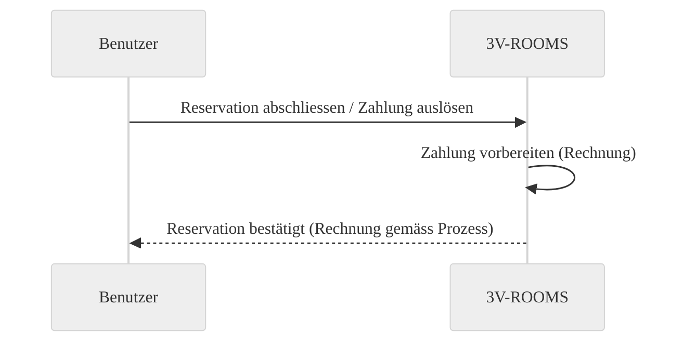

{}
Für das Erstellen/Bearbeiten von Zahlungsprovidern benötigen Sie:

- das Recht **„Darf Zahlungprovider verwalten"**

Details: [`Einstellungen → Sicherheitsdaten → Rollen → Rechte verwalten`](/3vrooms/einstellungen/sicherheitsdaten/rollen/rechteverwalten/).
{}

## Wo finde ich die Zahlungsprovider-Verwaltung?

Sie finden die Administration unter:

`Einstellungen` → `System` → `Zahlungsprovider`

## Wozu gibt es Zahlungsprovider?

Mit **Zahlungsprovidern** steuern Sie, **wie Zahlungen für kostenpflichtige Reservationen** abgewickelt werden – z.B. über eine externe Zahlungsseite (Kreditkarte/Wallet) oder über **Rechnung**.

Typische Einsatzfälle:

- Sie möchten Reservationen direkt online bezahlen lassen (z.B. Saferpay).
- Sie möchten Reservationen freigeben und später per Rechnung abrechnen (ohne externe Zahlungsabwicklung).

## Welche Zahlungsprovider werden unterstützt?

- **Saferpay**: Externe Zahlungsabwicklung über Worldline/SIX (z.B. Kreditkarten, Wallets – je nach Vertrag).
- **Rechnung**: Keine externe Zahlungsabwicklung; die Reservation wird bestätigt und die Rechnung wird später gestellt/versendet (gemäss Ihrem Prozess).

## Zahlungsprovider anlegen oder bearbeiten

1. Öffnen Sie `Einstellungen` → `System` → `Zahlungsprovider`.
2. Klicken Sie auf **Neu** (oder öffnen Sie einen bestehenden Eintrag).
3. Pflegen Sie die Felder (siehe unten).
4. Klicken Sie **Speichern**.

## Felder

### Stammdaten

- **Name**: Eindeutige Bezeichnung des Providers (z.B. „Saferpay“ oder „Rechnung“).
  - Verwenden Sie einen **klaren, stabilen Namen**, damit im Betrieb keine Verwechslungen entstehen.
  - Falls der Provider im Buchungsprozess «per Name» referenziert wird, muss dieser Name **exakt** passen (Gross-/Kleinschreibung beachten).
- **URL** (nur Saferpay): Basis-URL des Saferpay-Systems (Test oder Produktion).
- **Benutzername / Passwort** (nur Saferpay): Zugangsdaten, die Sie von Saferpay erhalten.
- **Konfiguration** (nur Saferpay): Saferpay-spezifische Optionen im JSON-Format.

{}
Führen Sie **Test** und **Produktion** getrennt (eigene Zugangsdaten/URLs), damit Testzahlungen nicht versehentlich im Produktivsystem landen.
{}

## Saferpay einrichten

Für Saferpay benötigen Sie typischerweise **URL**, **Benutzername**, **Passwort** und eine **Konfiguration**.

### Konfiguration (JSON)

Die Konfiguration ist ein JSON-Objekt. Üblich sind diese Schlüssel:


| Option | Typ | Was bedeutet das? | Woher bekomme ich das? |
|---|---|---|---|
| `customerId` | string | Ihre Saferpay Customer ID | Saferpay Vertrags-/Accountdaten |
| `terminalId` | string | Terminal-ID für die Zahlungsabwicklung | Saferpay Terminal-Konfiguration |
| `paymentMethods` | string[] | Welche Kartenarten erlaubt sind | Saferpay Vertrag (aktivierte Zahlungsmittel) |
| `wallets` | string[] | Welche Wallets erlaubt sind | Saferpay Vertrag (aktivierte Wallets) |


{}
Welche Zahlungsmittel Sie verwenden dürfen, hängt von Ihrem Saferpay-Vertrag ab. Wenn ein Zahlungsmittel nicht freigeschaltet ist, wird es im Checkout nicht angeboten.
{}

### Häufige Werte

**Payment Methods** (häufig):

- `VISA`
- `MASTERCARD`
- `AMEX`
- `DINERS`
- `MAESTRO`
- `VPAY`
- `POSTFINANCECARD`

**Wallets** (häufig):

- `PAYPAL`
- `TWINT`
- `APPLEPAY`
- `GOOGLEPAY`

### Beispiel-Konfigurationen

**1) Minimal (nur Identifikation; Zahlungsmittel kommen aus dem Vertrag/Standard)**

```json
{
  "customerId": "255759",
  "terminalId": "17729265"
}
```

**2) Karten + Wallets explizit festlegen**

```json
{
  "customerId": "255759",
  "terminalId": "17729265",
  "paymentMethods": ["VISA", "MASTERCARD", "AMEX"],
  "wallets": ["PAYPAL", "TWINT"]
}
```

**3) Nur Karten erlauben (keine Wallets)**

```json
{
  "customerId": "255759",
  "terminalId": "17729265",
  "paymentMethods": ["VISA", "MASTERCARD"]
}
```

**4) Nur Wallets anbieten (z.B. TWINT + PayPal)**

```json
{
  "customerId": "255759",
  "terminalId": "17729265",
  "wallets": ["TWINT", "PAYPAL"]
}
```

### Beispielwerte für URL

- **Produktion** (Beispiel): `https://www.saferpay.com/api/`
- **Test** (Beispiel): `https://test.saferpay.com/api/`

## Rechnung einrichten

Für **Rechnung** genügt in der Regel:

- **Name**: z.B. „Rechnung“

Die restlichen Felder bleiben leer (keine externe Verbindung).

Beispiel (ohne Konfiguration):

```json
{
  "name": "Rechnung"
}
```

## Wie läuft der Zahlungsprozess ab?

Im Alltag läuft es typischerweise so:

1. Eine Reservation wird erstellt (ggf. mit Kosten für Raum/Equipment/Catering).
2. Beim Auslösen der Zahlung wird die Zahlung vorbereitet.
3. Je nach Provider:
   - **Saferpay**: Weiterleitung zur Zahlungsseite und anschliessend Rückkehr in 3V-ROOMS.
   - **Rechnung**: Keine Weiterleitung; die Reservation wird bestätigt und anschliessend gemäss Ihrem Prozess abgerechnet.

### Statusmodell



### Ablauf mit Saferpay



### Ablauf mit Rechnung



## Löschen

Sie können Zahlungsprovider löschen. Prüfen Sie vorher, ob der Provider noch für laufende Prozesse benötigt wird.

{}
Wenn ein Zahlungsprovider im Betrieb verwendet wird, kann Löschen zu Rückfragen oder Inkonsistenzen bei bestehenden Reservationen/Zahlungen führen. Deaktivieren/ersetzen Sie den Provider nach Möglichkeit geplant.
{}

## Häufige Probleme

- **Zahlungsart/Provider steht nicht zur Verfügung**: Prüfen Sie, ob der Zahlungsprovider korrekt angelegt und vollständig gepflegt ist.
- **Saferpay-Verbindung klappt nicht**: URL (Test/Produktion) sowie Benutzername/Passwort prüfen; bei Bedarf Saferpay-Zugang testen lassen.
- **Bestimmte Zahlungsmittel fehlen**: Konfiguration (z.B. `paymentMethods`/`wallets`) sowie Saferpay-Vertrag prüfen.