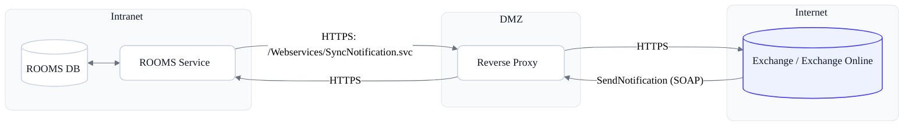

### Was ist Push-Synchronisation?

Bei Push-Synchronisation informiert Exchange ROOMS aktiv über Änderungen (neue/aktualisierte Elemente). ROOMS hält dafür eine Subscription auf Postfächer/Folders und stellt einen öffentlichen Webservice bereit, an den Exchange Benachrichtigungen sendet. ROOMS verarbeitet die Meldung und synchronisiert die betroffenen Elemente nach.

Vorteile:
- Sehr wenig Datenverkehr (nur Ereignisse, kein Polling)
- Niedrige Latenz
- Bewährtes Setup für On-Prem und Online

### Architekturüberblick

Hinweis: Für Exchange Online muss die veröffentlichte URL aus dem Internet erreichbar sein – direkt oder via Reverse Proxy. Der interne ROOMS Service bleibt dabei privat. Veröffentlichen Sie nur den Pfad `Webservices/SyncNotification.svc`, ohne Pre‑Authentication (anonyme Anfragen zulassen) und mit gültigem, öffentlich vertrauenswürdigem TLS‑Zertifikat. Idealerweise IP‑Allowlisting auf Microsoft‑Ranges.

DMZ/Reverse Proxy ist optional:
- Wenn Sicherheitsrichtlinien es erlauben, kann der ROOMS Webservice direkt veröffentlicht werden.
- Ein Reverse Proxy wird empfohlen (TLS-Offload, IP-Filter, WAF/Rate-Limiting, Logging).

Service-URL in ROOMS:
- [Applikation Root-Url Anonymous]()
- Format: `http(s)://<rooms-host>/Webservices/SyncNotification.svc`

### Funktionsablauf

1. ROOMS registriert bei Exchange eine Push-Subscription auf relevante Ordner.
2. Bei Änderungen sendet Exchange eine `SendNotification`-SOAP-Nachricht an `SyncNotification.svc`.
3. ROOMS bestätigt den Empfang und schreibt ein Ereignis in die Datenbank.
4. Der ROOMS-Synchronisationsdienst liest die Ereignisse und aktualisiert betroffene Reservierungen.

Wenn alles korrekt konfiguriert ist und Sie die URL im Browser öffnen, erscheint eine Bestätigungsseite:



### Sicherheitsempfehlungen

- Nur den Webservice `Webservices/SyncNotification.svc` veröffentlichen, nicht die gesamte ROOMS-Anwendung
- Zugriff auf bekannte Exchange-IP-Bereiche beschränken: https://docs.microsoft.com/en-us/microsoft-365/enterprise/urls-and-ip-address-ranges?view=o365-worldwide
- Eingehende Requests prüfen und verwerfen, wenn sie nicht passen:
  - Methode: `POST`
  - Pfad: `/Webservices/SyncNotification.svc`
  - SOAPAction: `http://schemas.microsoft.com/exchange/services/2006/messages/SendNotification`
