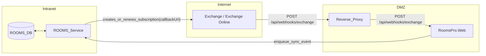

### Was ist Push-Synchronisation?

Bei Push-Synchronisation informiert Exchange ROOMS aktiv über Änderungen (neue/aktualisierte Elemente). ROOMS hält dafür eine Subscription auf Postfächer/Folders und stellt einen öffentlichen Webservice bereit, an den Exchange Benachrichtigungen sendet. ROOMS verarbeitet die Meldung und synchronisiert die betroffenen Elemente nach.

Vorteile:
- Sehr wenig Datenverkehr (nur Ereignisse, kein Polling)
- Niedrige Latenz
- Bewährtes Setup für On-Prem und Online

### Architekturüberblick

Hinweis: Für Exchange Online muss die veröffentlichte URL aus dem Internet erreichbar sein – direkt oder via Reverse Proxy. Der interne ROOMS Service bleibt dabei privat. Veröffentlichen Sie den Pfad `/api/webhooks/exchange` (RoomsPro.Web), ohne Pre‑Authentication (anonyme Requests zulassen) und mit gültigem, öffentlich vertrauenswürdigem TLS‑Zertifikat. Idealerweise IP‑Allowlisting auf Microsoft‑Ranges.

DMZ/Reverse Proxy ist optional:
- Wenn Sicherheitsrichtlinien es erlauben, kann der ROOMS Webservice direkt veröffentlicht werden.
- Ein Reverse Proxy wird empfohlen (TLS-Offload, IP-Filter, WAF/Rate-Limiting, Logging).

Service-URL in ROOMS:
- [IDP Root-Url]()
- Standard-Callback: `IdpRootUrl + /api/webhooks/exchange`

### Konfiguration (RoomsAppSettings / Environment Variables)

Die Werte werden aus `RoomsContext.AppSettings` gelesen (Konfiguration via `RoomsAppSettings.config`) und können via Environment Variables überschrieben werden (Twelve-Factor).

- **`ExchangePushNotificationEndpointUrl`** (string, optional)  Wenn gesetzt, wird diese URL **1:1** als Callback registriert (muss eine **absolute URL** sein).
- **`ExchangePushNotificationUseLegacyEndpoint`** (bool, optional, Default `false`)  Wenn `true` und kein Override gesetzt ist, wird das **Legacy**-Callback verwendet (Rollback).

**Precedence**:1. `ExchangePushNotificationEndpointUrl`2. `ExchangePushNotificationUseLegacyEndpoint=true`3. Default: `IdpRootUrl + /api/webhooks/exchange`

**Local dev**:Setzen Sie `ExchangePushNotificationEndpointUrl` auf eine von Exchange erreichbare URL (z. B. per Tunnel):`https://<your-tunnel-host>/api/webhooks/exchange`

**Prod rollback**:Setzen Sie `ExchangePushNotificationUseLegacyEndpoint=true` und stellen Sie sicher, dass die Legacy-URL weiterhin erreichbar ist:`https://<rooms-host>/WebServices/SyncNotification.svc?{tenant}`

### Funktionsablauf

1. ROOMS registriert bei Exchange eine Push-Subscription auf relevante Ordner.
2. Bei Änderungen sendet Exchange eine HTTP-Notification an den Callback `POST /api/webhooks/exchange`.
3. ROOMS bestätigt den Empfang und schreibt ein Ereignis in die Datenbank.
4. Der ROOMS-Synchronisationsdienst liest die Ereignisse und aktualisiert betroffene Reservierungen.

Hinweis: Der neue Callback ist ein REST-Endpoint und hat **keine** Bestätigungsseite im Browser. Für eine einfache Erreichbarkeitsprüfung kann `IdpRootUrl + /healthz` verwendet werden.

### Sicherheitsempfehlungen

- Zugriff auf bekannte Exchange-IP-Bereiche beschränken: https://docs.microsoft.com/en-us/microsoft-365/enterprise/urls-and-ip-address-ranges?view=o365-worldwide
- Eingehende Requests prüfen und verwerfen, wenn sie nicht passen:
  - Methode: `POST`
  - Pfad: `/api/webhooks/exchange`
