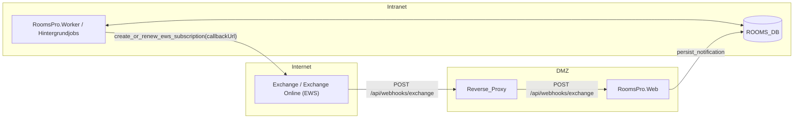

{}
Diese Seite gilt **nur** für die **EWS-basierten** SyncModi:

- `EWS1`
- `EWS2`
- `O365`

Der SyncModus `Microsoft365` verwendet **keine Exchange Push Subscription**, sondern **Graph-Webhooks** auf:

- `/api/webhooks/graph`
- `/api/webhooks/graph/lifecycle`
{}

## Was ist Push-Synchronisation?

Bei der EWS-basierten Push-Synchronisation informiert Exchange ROOMS aktiv über Änderungen (neue / aktualisierte Elemente). ROOMS hält dafür eine Subscription auf Postfächer bzw. Ordner und stellt einen öffentlichen Webservice bereit, an den Exchange Benachrichtigungen sendet.

Vorteile:

- sehr wenig Datenverkehr (nur Ereignisse, kein Polling)
- niedrige Latenz
- bewährtes Setup für EWS On-Prem und EWS Exchange Online (`O365`)

## Architekturüberblick


```mermaid
flowchart LR
  subgraph intranet [Intranet]
    direction LR
    RoomsDB[(ROOMS_DB)]
    Worker["RoomsPro.Worker / Hintergrundjobs"]
    Worker <--> RoomsDB
  end

  subgraph dmz [DMZ]
    ReverseProxy[Reverse_Proxy]
    RoomsProWeb["RoomsPro.Web"]
  end

  subgraph internet [Internet]
    Exchange["Exchange / Exchange Online (EWS)"]
  end

  Worker -->|"create_or_renew_ews_subscription(callbackUrl)"| Exchange
  Exchange -->|"POST /api/webhooks/exchange"| ReverseProxy
  ReverseProxy -->|"POST /api/webhooks/exchange"| RoomsProWeb
  RoomsProWeb -->|"persist_notification"| RoomsDB
```

## Wichtige Änderung gegenüber älteren Setups

Die frühere explizite Service-Session `pushSubscriberServiceSession` wird in produktiven Setups **nicht mehr separat aktiviert**.

Subscription-Erstellung und -Erneuerung laufen über die Hintergrundverarbeitung / `RoomsPro.Worker`, insbesondere über:

- `ProvisionEwsSubscription`
- `EwsSubscriptionManagement`

## Veröffentlichung des Webhooks

Für EWS-basierte Push-Subscriptions muss die veröffentlichte URL aus dem Internet erreichbar sein - direkt oder via Reverse Proxy.

Veröffentlichen Sie den Pfad:

```text
/api/webhooks/exchange
```

Empfehlungen:

- anonyme `POST`-Requests zulassen
- gültiges öffentlich vertrauenswürdiges TLS-Zertifikat
- idealerweise Reverse Proxy mit Logging, Rate Limiting und IP-Filter

## Service-URL in ROOMS

- [IDP Root-Url]()
- Standard-Callback: `IdpRootUrl + /api/webhooks/exchange`

## Konfiguration (RoomsAppSettings / Environment Variables)

Die Werte werden aus `RoomsContext.AppSettings` gelesen (Konfiguration via `RoomsAppSettings.config`) und können via Environment Variables überschrieben werden.

- **`ExchangePushNotificationEndpointUrl`** - optionale absolute Override-URL
- **`ExchangePushNotificationUseLegacyEndpoint`** - optionaler Rollback auf `SyncNotification.svc`

Precedence:

1. `ExchangePushNotificationEndpointUrl`
2. `ExchangePushNotificationUseLegacyEndpoint=true`
3. Default: `IdpRootUrl + /api/webhooks/exchange`

**Local dev**

```text
https://<your-tunnel-host>/api/webhooks/exchange
```

**Prod rollback**

```text
https://<rooms-host>/WebServices/SyncNotification.svc?{tenant}
```

## Funktionsablauf

1. ROOMS registriert bei Exchange eine Push-Subscription auf relevante Ordner.
2. Bei Änderungen sendet Exchange eine HTTP-Notification an `POST /api/webhooks/exchange`.
3. ROOMS bestätigt den Empfang und schreibt das Ereignis in die Datenbank.
4. Die weitere Verarbeitung übernimmt die ROOMS-Synchronisationslogik.

Für eine einfache Erreichbarkeitsprüfung kann zusätzlich `IdpRootUrl + /healthz` verwendet werden.

## Sicherheitsempfehlungen

- Zugriff auf bekannte Exchange-IP-Bereiche beschränken: https://learn.microsoft.com/en-us/microsoft-365/enterprise/urls-and-ip-address-ranges
- eingehende Requests prüfen und verwerfen, wenn sie nicht passen:
  - Methode `POST`
  - Pfad `/api/webhooks/exchange`

## Graph statt EWS?

Wenn Sie `Microsoft365` einsetzen, verwenden Sie stattdessen die Seite [Microsoft 365 (Graph API)]().
